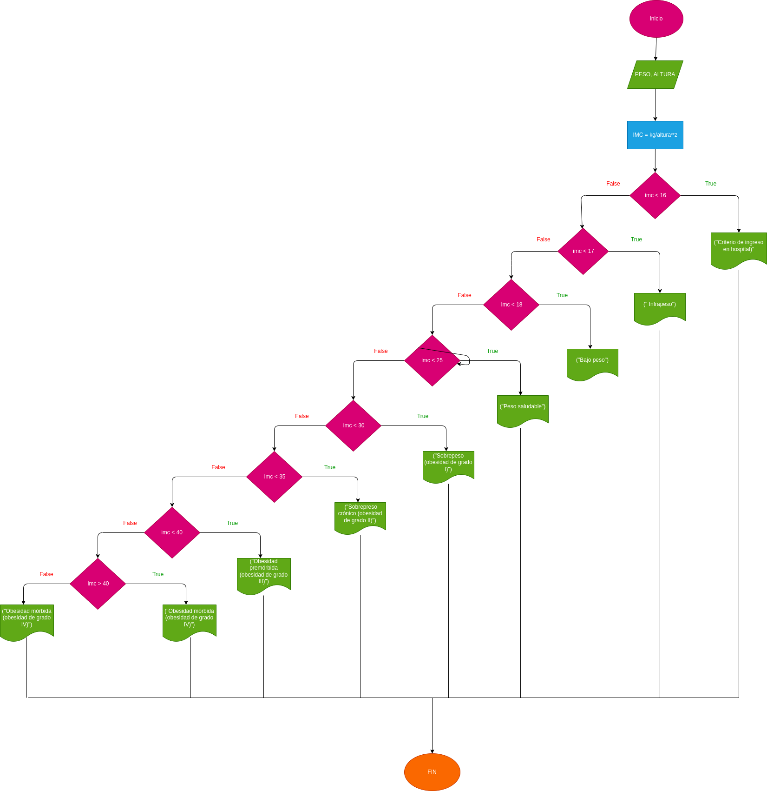

# Masa corporal
Construir un programa que calcule el índice de masa corporal de una persona
(IMC = peso[kg] / altura2 [m]) e indique el estado en el que se encuentra esa
persona en función del valor del IMC:

# Diseño

## Diagrama de flujo 

